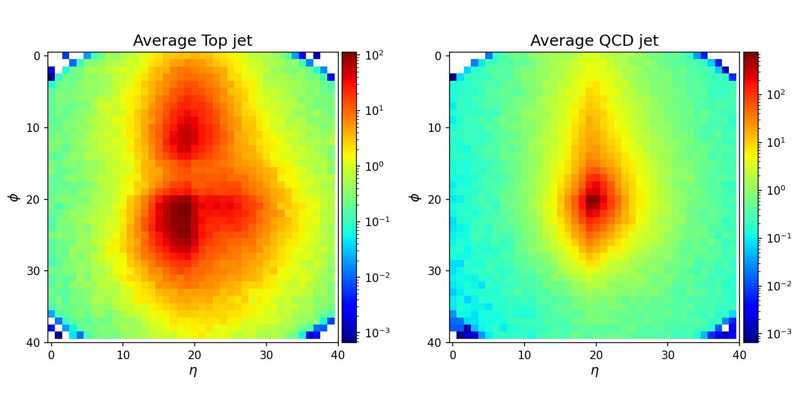

# Top-Tagging

The task of this exercise is to write a custom neural network model that is able to distinguish top jets from
mixed quark-gluon jets.

## Data Set

The top signal and mixed quark-gluon background jets are produced with Pythia8 with its default tune for a center-of-mass energy of 14 TeV and ignoring multiple interactions and pile-up. For a simplified detector simulation Delphes with the default ATLAS detector card was used. The fat jet is then defined through the anti-kT algorithm in FastJet with $R = 0.8$. We only consider the leading jet in each event and require

$$
p_{\mathrm{T},j} = 550 .... 650\text{ GeV}.
$$

For the signal only, we further require a matched parton-level top to be within $\Delta R = 0.8$, 
and all top decay partons to be within $\Delta R = 0.8$ of the jet axis as well. No matching is performed for the QCD jets. Further, we require

$$
|\eta_j|<2.
$$

The constituents are extracted through the Delphes energy-flow algorithm, and the 4-momenta of the leading 200 constituents are stored. For jets with less than 200 constituents we simply add zero-vectors.

### Preprocessing

We perform a specific preprocessing before pixelating the image. First, we center and rotate the jet according to its $p_\mathrm{T}$-weighted centroid and principal axis. Then we flip horizontally and vertically so that the maximum intensity is in the upper right quadrant. Finally, we pixelate the image with $p_\mathrm{T}$ as the pixel intensity, and normalize it to unit total intensity. We end up with 40 x 40 jet images as seen below.



### Size

The preprocessd data set consists of 80k signal and 80k background jets. They are divided into three samples: training with 50k signal and background jets each, validation with 15k signal and background jets each, and testing with 15k signal and 15k background jets.

NOTE: There is more raw data, however the Colab input-pipeline does not allow to use more jet images.

### Download data

The data is downloaded automatically by executing the corresponding line in `top_tagging.ipynb`:

```Jupyter Notebook
!curl https://www.dropbox.com/s/abd8xntlaorzzvy/train_img.h5?dl=1 -L -o train_img.h5
!curl https://www.dropbox.com/s/cmxe03vjfzhm70i/val_img.h5?dl=1 -L -o val_img.h5
!curl https://www.dropbox.com/s/csxe65ykvmomxcs/test_img.h5?dl=1 -L -o test_img.h5
```

